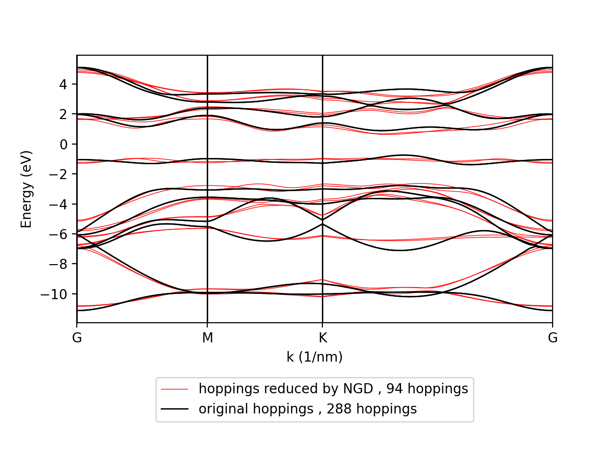

# Sparse-Tight-Binding for TMDCs: Parameter Reduction through Gradient-based Optimization
<div align="center">
  <br>
  
  <br>
  <em>Bandstructure of the reduced model vs original model</em>
  <br>
  <br>
  <br>
</div>

Layered molybdenum disulfide (MoS2) structures are a well known example of transition-metal dichalcogenide (TMD) monolayers. Due to its bandgap of 1.8 eV, MoS2 - as other TMDs - has great potential in microelectronics for transistors or photodetectors.   


A common way to simulate TMD behaviour is to use tight-binding theory. While many of these tight-binding models are able to reasonably reproduce the reference band structures, the models are often computationally very expensive in their calculations. The aim of this project is to substentially reduce the number of parameters of such a model, while simultaniously keeping the calculated bandsturcture close to the original.  

## Background and Acknowledgements
This project was developed as part of my Bachelor's thesis at the Institute for Theoretical Physics (ITP) at Vienna University of Technology (TU Wien), under the supervision of Max Sinner (MSc.) and Prof. Florian Libisch.  
This github repository showcases the technical implementation of my Bachelor's thesis.  
The full thesis document can be found in this root folder.

## Installation
### Dependencies

- **tbplas** >= 1.6  
TBPLaS (Tight-Binding Package for Large-scale Simulation) is used in this project for tight binding calculations. Follow the [installation guide](https://www.tbplas.net/install.html) to install TBPLaS to your system.
- **python** ≥ 3.9  
matplotlib, numpy

### Installation in Linux
After installing the necessary dependencies, clone the github repository: 

```bash
git clone https://github.com/BastianGuggenberger/sparse-tight-binding-TMDCs
```
Navigate to "resources/mos2class/" and set the variable "idealhoppath":  

```python
#-----------------------------------------------------
#PATHS:
idealhoppath= "-set your repository path-/sparse-tight-binding-TMDCs/resources/idealhoplist/idealhoplist.txt"

#-----------------------------------------------------
```

## Usage
Before running any pyhton scripts, make sure to set the right configuration variables in the script.  

For example, to run "results/results.py", set:  
```python
#-----------------------------------------------------
#VARIABLES (IMPORTANT):
pathsettings = "customized"

...

elif (pathsettings == "customized"):
    path_runs = "tests/"
    path_output = "tests/formated_results/"
    path_mvsN_output = "tests/mvsNanalysis/"

path_mvsN_energyorder_file = "../resources/mvsN_energyorder/mvsN_energyorder.txt"

IDset = [60000] #IDs of Runs to evaluate
E_min = 0.1 #Must be same as in pca_graddesc.py

```  

You will also have to set these run IDs when running the main scripts in graddesc_mos2.  


### Project Structure

- **graddesc_mos2/**
The main scripts for performing the simplification algorithms are stored in "graddesc_mos2/". Read the [graddesc_mos2-README](graddesc_mos2/README.md) for more information.  

- **results/**
The main scripts in "graddesc_mos2/" store their results in .txt format in "results/-runtype-/...". Additionaly, many scripts and plots for analysing these results can be found in this folder. For more details and an overview over the project outcome, read the [results-README](results/README.md).  

- **resources/**
The main scripts in "graddesc_mos2/" depend on the class "mcell", functions and files, which are stored in the resources folder. Read the [resources-README](resources/README.md) for more information.  

- **plots/**
Plots used in the thesis, and the python scripts to obtain them are stored here. Read the [plots-README](plots/README.md) for more information.  

- **SVD_mos2/**
This folder contains the unsuccesful attempt to reduce the MoS2 tight-binding parameters with an SVD-truncation.

## Support
Email: bastian.guggenberger@aon.at

## License
This project is licensed under the MIT License – see the [LICENSE](../LICENSE.txt) file for details.