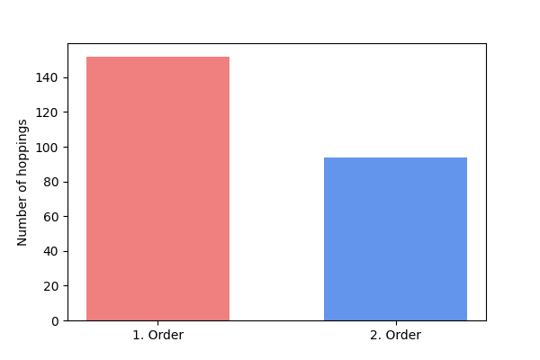

# Plots
The "plots" folder contains python scripts for building plots used in the thesis.  
The plots are stored in the folder "plots/pngs/".  

- **bandgapillustration:**  
Plots and stores the bandstructure of the original Roldán et al MOS2 model.  
The bandgap is illustrated by plotting the bands near the bandgap in a different color.  
  

- **degrees:**  
Analyses and plots neighbours degrees of the original Roldán et al tight binding model.  
  

- **hoppingorders:**  
Plots how 1st and 2nd order hoppings look like in the primitive cell.  
  

- **orbitals:**  
Prints orbitals in the R Roldán model to "orbitals.txt"  

- **sqrtabs:**  
Plots sqrt(abs(x)) function.  
  