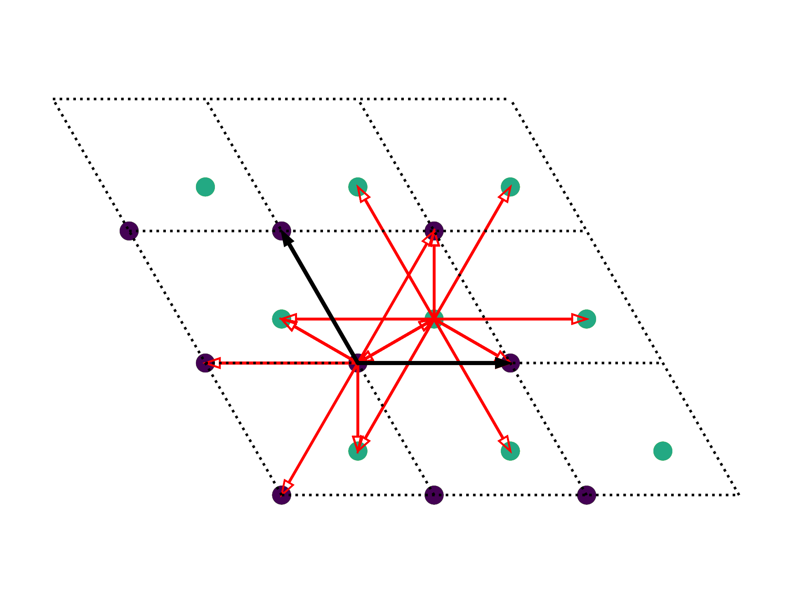

# Resources
The "reduced_mos2/resources" - folder is mostly based on TBPLaS calculations and contains the following resources, essential for the project:  

## mos2class
<figure align="center">
  
</figure>   
""reduced_mos2/resources/mos2class/mos2class.py" is a helper script containing the class "mcell" and several useful functions.  

- **Class "mcell":**  
Class for adding, deleting, analyzing mos2 hopping terms with different methods.  
Based on tbplas method make_mos2_soc, which is an implementation of:  
R Roldán et al 2014 2D Mater. 1 034003  
https://www.tbplas.net/_api/tbplas.make_mos2_soc.html  
the custom class variable-, method- and all custom function- names start with an "m" for better distinguishability to tbplas.  

- **Function "mmetric":**  
Metric for the difference between Bandstructures of two mos2-cells  

- **Function "mmaxerroratbandgap":**  
returns the largest error of the predicted vs original bands near the bandgap.  

- **Function "msafebandstructure":**  
safes a comparison between bandstructures of different cells.  

- **Function "mxtohopvec":**  
makes a list of hoppings based on a list of weights of each hopping.  

## idealhoplist
"reduced_mos2/resources/idealhoplist/idealhoplist.py" creates the file "reduced_mos2/resources/idealhoplist/idealhoplist.txt" containing hoppings as rows in python-list format.  
The stored hoppings are all hoppings from the  R Roldán et al paper without their imaginary part.  
The TBPLAS-implementation of the R Roldán model "make_mos2_soc" is used for that, however this implementation contains some hoppings twice, which is also fixed here.  
The resulting hoplist ist used each time a new "mcell" is constructed.  

## idealhoplist_multilevel
"reduced_mos2/resources/idealhoplist_multilevel/idealhoplist_multilevel.py" takes the "reduced_mos2/resources/idealhoplist/idealhoplist.txt" file as input and orders its hoppings in differnt degrees of neighbourhood. The result is safed in "reduced_mos2/resources/idealhoplist_multilevel/idealhoplist_multilevel.txt" and used in "reduced_mos2/mos2_multilevel_graddesc.py"

## mvsN_energyorder
"reduced_mos2/resources/mvsN_energyorder/mvsN_energyorder.py" calculates the mmetric (metric for the difference between the reduced cell bands and the original bands) for mos2_cells with hoppings reduced in order of ther hopping energy.  
The results are stored in "reduced_mos2/resources/mvsN_energyorder/mvsN_energyorder.txt".  
Also plots are generetad and stored in "/reduced_mos2/results/energyorder_2.0/energyorder_Metric_vsN_newmos2class.png"  
