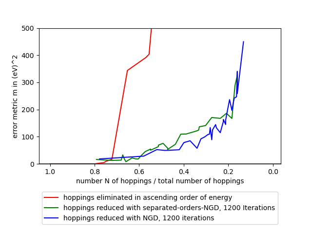

# Results
The "reduced_mos2/results" - folder contains all result files from the graddesc runs, as well as a general and several special python scripts for formating these results.  

<figure align="center">
  
  <figcaption style="text-align:center;">Performance of the NGD Algorithm for MoS2: Ratio of remaining hoppings vs error of the bandstructure calculation</figcaption>
</figure>  

## Types of runs and folder structure  
In this project, several different settings and variations of gradient descent were experimented.  
The result of each of these "runtypes" are each stored in a seperate folder:  

- **energyorder_2.0:**  
In this method, no gradient descent algorithm is used.  
Instead, the cell hoppings are reduced in order of their hopping energy.  

- **highiterations_2.0:**  
Runs with these setting were done by the classic gradient descent algorithm "reduced_mos2/graddesc_mos2/mos2_graddesc.py", using 1200 iterations.  

- **lowiterations_2.0:**  
Runs with these setting were done by the classic gradient descent algorithm "reduced_mos2/graddesc_mos2/mos2_graddesc.py", using only 400 iterations.  

- **multilevelruns_2.0**  
These runs were produced by "reduced_mos2/graddesc_mos2/mos2_multilevel_graddesc.py", where the algorithm optimizes first and second degree neighbours distinctly. Still a total of 1200 iterations were used.

- **bandgapruns_2.0:**  
Runs with these setting were done by "reduced_mos2/graddesc_mos2/mos2_bandgap_graddesc.py", a version of the classig NGD algorithm "mos2_graddesc.py" where the algorithm prioritizes optimization in the bands near the bandgap.   

- **tests**  
Used for testruns, after changes in the scripts or folderstructure.  

The types of results in each of these folders is described below.  
"results.py" and other scripts in "special_results" are used to get formated results(pngs) out of the raw data.  
A summary of some good results is stored in the folder "importantresults".  

## unformated results
the main programs of this project ("reduced_mos2/graddesc_mos2/mos2_graddesc.py", etc. ...) store the following raw data in .txt format, in the folders "reduced_mos2/results/-runtype-/":

- **graddesc_finalx_run1234.txt:**  
the final hoppingvector of the run stored as "x" (coordinates relative to the ideal hopping vector).  

- **graddesc_x_run1234.txt:**  
the hoppingvector of each iteration stored as "x" (coordinates relative to the ideal hopping vector).  

- **graddesc_history_run1234.txt:**  
the history of the gradient descent run - an overview over each iteration.  

- **graddesc_params_run1234.txt**  
the parameters (lambdas, iterations, ...) of the run.  

## formated results

### results.py
The general-result-formating script "reduced_mos2/results/results.py" produces the following output in the folder "reduced_mos2/results/-runtype-/formated_results/":  

- **graddesc_bands_run1234.png:**  
Bandstructure plot of MOS2 cell with all hoppings vs MOS2 cell with hoppings redused by the given method:  
  

- **graddesc_cellplot_run1234.png:**  
A plot of the final reduced MOS2 cell:  
  

- **graddesc_xvector_run1234.png:**  
A plot of the remaining hoppings, plotted as relative coordinates (x-vector):  
  

Also the information about the metric is stored in "reduced_mos2/results/-runtype-/mvsNanalysis/mvsN_run1234.txt".  

### special_results/
The folder "reduced_mos2/results/special_results/" contains several other scripts for plotting certain results:  

- **mvsN/ :**  
The scripts take the mvsN (metric vs remaining number of hoppings) information of each run from "reduced_mos2/results/-runtype-/mvsNanalysis/mvsN_run1234.txt" and stores a plot of this information in the folder "reduced_mos2/results/-runtype-/formated_results/".  
It also plots a comparison of all mvsNs of all different methods and stores this in the "importantresults" folder.  
  

- **historyanalysis/ :**  
The scripts produce a plot of the mvsN information of a certain run over its iterations:  
  
The plots are stored in the "importantresults" folder.  

- **finalx/ :**  
The scripts produce a plot of final x vector, seperated into degrees of order:  
  
The plots are stored in the "importantresults" folder.   

- **bandstructures/bandgapanalysis.py :**  
Prints the maximum error of the reduced model near the bandgap.  

- **bandstructures/bandstructures.py :**  
Creates a plot of a bandstructure comparison for evaluating the performance of the project:  
  
The plot is stored in the "importantresults" folder.   
